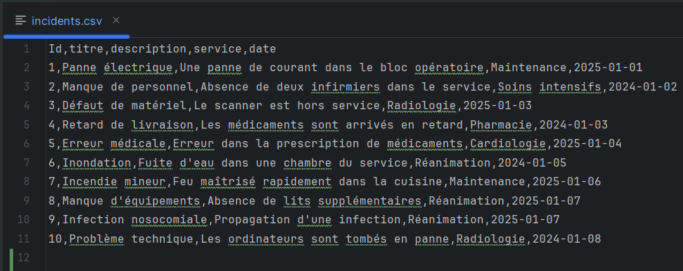
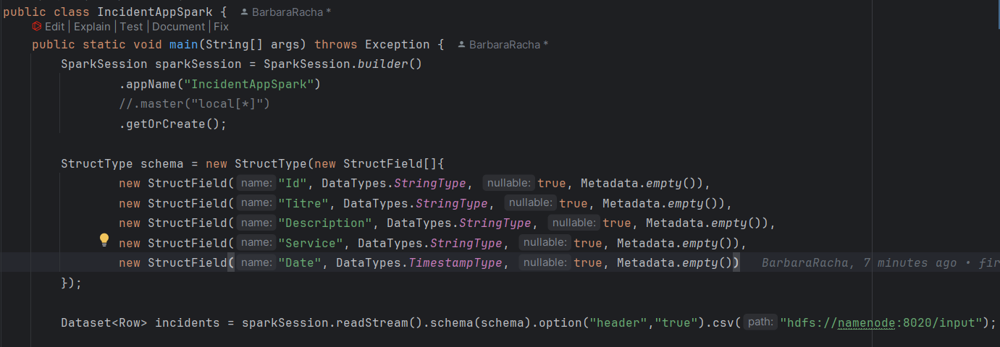
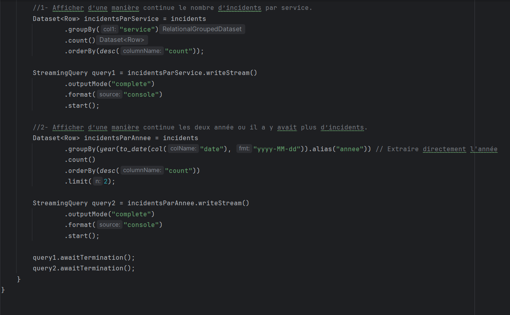
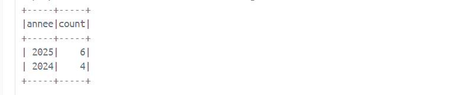
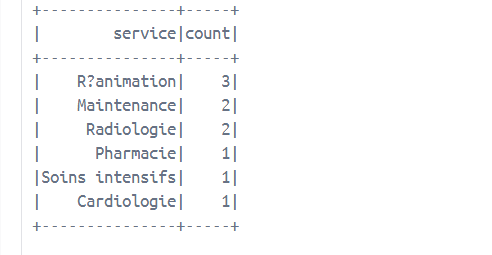

# Application Spark pour la gestion des incidents hospitaliers en streaming
 
Ce projet développe une application Spark qui reçoit des incidents de l'hôpital en temps réel grâce à Structured Streaming. Les incidents sont reçus sous forme de fichiers CSV continuellement. 
Le format des données dans ces fichiers CSV est le suivant :
 

CODE de la classe "IncidentAppSpark"

SORTIE: 

